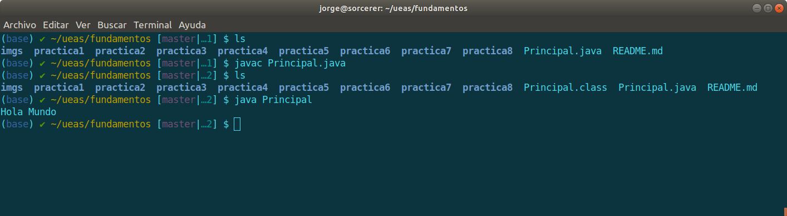

## Prácticas de Fundamentos de Programación

### Resumen
En este repositorio están las prácticas a realizar durante el trimestre. Están compuestas por un conjunto de ejercicios resueltos y un conjunto de problemas que se deben resolver. Se espera que los reportes se presenten en un repositorio parecido a este.

### Desarrollo
Debe crear un directorio para cada práctica, la cual debe contener archivos con código JAVA y un archivo "README punto md" con las mismas secciones que éste archivo.

### Resultados
En esta sección además de mostrar los resultados, puede describir las instrucciones para compilar y ejecutar el código o hablar sobre alguna particularidad del código, la organización de los archivos o las herramientas utilizadas.

~~~
public class Principal {

	public static void main(String[] args) {		
		System.out.println("Hola Mundo");
	}

}
~~~

### Discusión

Interpretación de los resultados.

### Conclusiones

A modo de respuesta a las preguntas plantadas o a los objetivos.

:octocat: :metal: 
