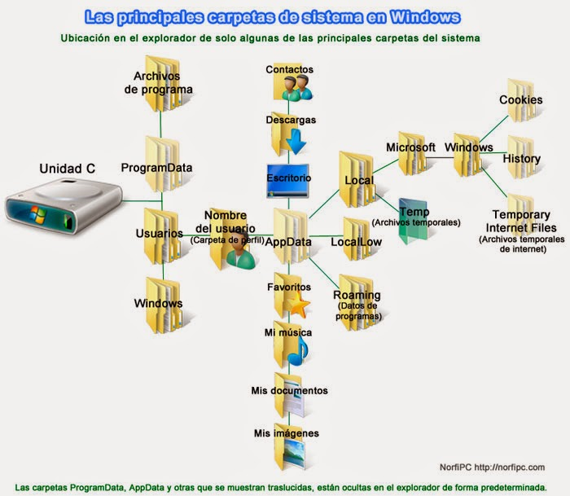
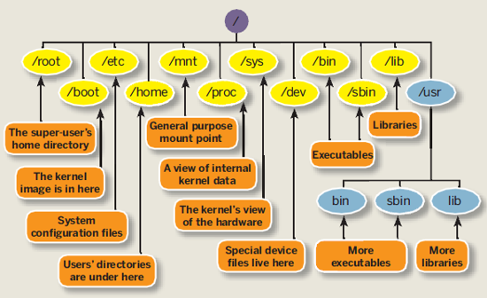
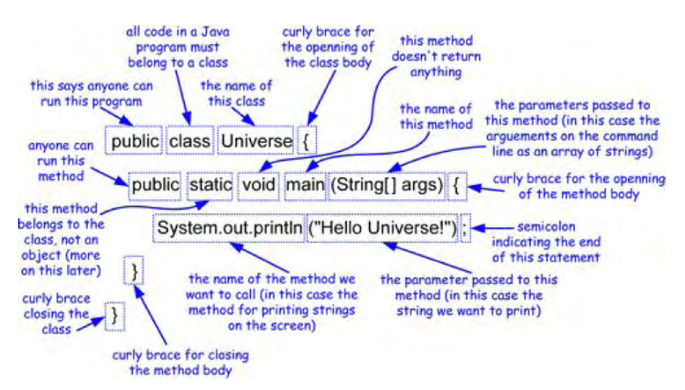

## Practica 1

## Resumen

Se hacen diversos ejercicios para familiarizarse con el ambiente de desarrollo de programas.

## Desarrollo

- Sistema Operativo
- Editor de código
- JDK
- Git, GitBash y GitHub
- Markdown

## Resultados

Resultados ...

## Discusión de resultados

## Conclusiones

Conclusiones...

:rocket:

